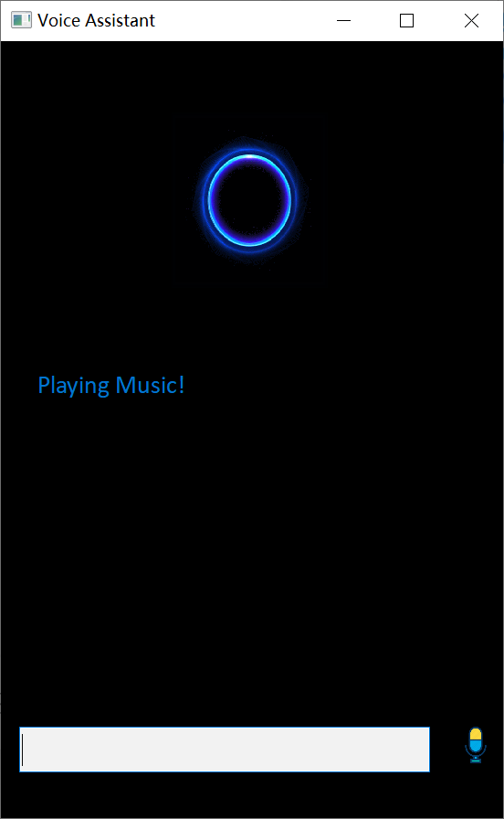

## Lab 1 Automatic Speech Recognition

[TOC]

### 1. Introduction

### 2. Environment Configuration

##### 2.1 development environment

- PyCharm 2021.1

- Python 3.8

##### 2.2 Reference module

- SpeechRecognition
- PocketSphinx
- PyAudio
- PyQt5

##### 2.3 Step

1. install SpeechRecognition

    Create a new project in Pycharm named lab1_asr

   

    Open “File->settings” from the menu bar

   

    Click “+” icon

   

    Input “SpeechRecognition” in the search box and select

   

    Install SpeechRecognition package by clicking the button

   

2. install PocketSphinx

    Download right binary library from [https://www.lfd.uci.edu/~gohlke/pythonlibs/#](https://www.lfd.uci.edu/~gohlke/pythonlibs/)[pocketsphinx](https://www.lfd.uci.edu/~gohlke/pythonlibs/)

   

   Select the correct installation package for the corresponding Python version. And here I choose cp38. Copy the file to your working directory 

   

   Install .whl file in command window using the following command

   ​	python -m pip install pocketsphinx-0.1.15-cp38-cp38-win_amd64.whl

   

3. install PyAudio

    Download right binary library from

    [https://www.lfd.uci.edu/~gohlke/pythonlibs/#](https://www.lfd.uci.edu/~gohlke/pythonlibs/)[pyaudio](https://www.lfd.uci.edu/~gohlke/pythonlibs/)

   

   Select the correct installation package for the corresponding Python version. And here I choose cp38. Copy the file to your working directory 

   

   Install .whl file in command window using the following command

   ​	python -m pip install PyAudio-0.2.11-cp38-cp38-win_amd64.whl

   

4. install PyQt5

   Similar to step 1

   Input “PyQt5” in the search box and select

   

   install pyqt5 and pyqt5-tools

### 3. Report

+ The modifications to GUI and the codes

  1. Add some instruction help in Gui, and modify the position and size of each label.
  2. Add the input box, easy to enter instructions to perform tasks.
  3. Add listen button, easy to start listening.
  4. Some interaction logic is optimized.

+ The accuracy of speech recognition and how to improve it, if possible?

  The accuracy of speech recognition is very low. Make the program hard to use.

  For how to improve accuracy, I think there are two solutions. One is to add fuzzy word discrimination, so that the program can recognize more instructions. The other is to use speech API with higher recognition accuracy, such as Google and iFLYTEK.

### 4. Screen shot

+ Main Page

  

  **The result of voice input is the same as that of text input**

+ Listen

  

+ Play Music

  

  

  

+ Open notepad

  

  

+ Open Calculator

  

